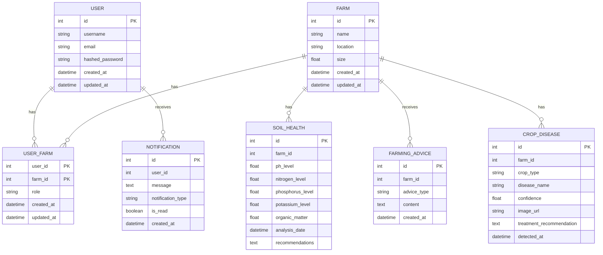

# Farmer's Guide



### Explanation
- **Entities**:
  - `USER`, `FARM`, `SOIL_HEALTH`, `NOTIFICATION`, `FARMING_ADVICE`, `CROP_DISEASE`, `USER_FARM`
  
- **Relationships**:
  - Users can have many notifications, and notifications belong to one user.
  - Farms can have many soil health records, farming advice, crop diseases, and user-farm relationships.
  - Soil health records, farming advice, and crop diseases belong to one farm.
  - The `USER_FARM` table creates a many-to-many relationship between users and farms, with additional attributes such as role, created_at, and updated_at.


## How to Contribute

Farmer guide API is a Python application, so you'll need a working Python environment to run it.

### Python Version

The API currently requires Python 3.9+.

### Create a Virtual Environment
It's recommended to create and activate a virtual environment before installing dependencies.

Python offers a built-in method for installing lightweight virtual environments, the `venv` module. To create a virtual environment with this command:

```shell
$ python3 -m <path to virtual environment>
```

After you've created your new virtual environment, you'll need to activate it in order to ensure subsequent commands use it instead of your system's default Python environment.

```shell
$ source .venv/bin/activate
```
### Install Dependencies
After you've created your virtual environment, you'll want to ensure that the correct dependencies are installed.

Run the pip command below to instead dependencies

```shell
 $  pip install -r requirements.txt
```
### Initialize Pre-Commit Hooks in the Repository

To configure git to use the API's configured pre-commit hooks (defined in [.pre-commit-config.yaml](.pre-commit-config.yaml)).

### Install the Pre-Commit Hook Package with Pip

```shell
$ python3 -m pip install pre-commit

$ pre-commit install
```
## Start API manually


0. **Install Required Packages**

Install dependencies using the command given above

2. **Create A Database**

In order to perform migrations and run the app, you'll need to create a database.
you should create a database called `farmerguide`
To do this, you can use the [Postico](https://eggerapps.at/postico/) app or any other Postgresql client of your choice.

2. **Copy `.env` & set correct values**

The easiest way to set all environment variables needed for the API is to copy from sample:

$ cp .env_sample .env

The most important thing is to set DATABASE_URL. DATABASE_URL is mandatory and must be set to successfully run the API.

3. **Copy `alembic.ini` & check sqlalchemy.url**

In order for alembic to successfully run migrations, you'll need to update the `sqlalchemy.url` line in `alembic.ini`. An example of `alembic.ini` has been provided at `alembic.ini.example`. If you haven't already added your own version of this file, run the following command:

$ cp alembic.ini.example alembic.ini


Then, open `alembic.ini` in your editor of choice and ensure `sqlalchemy.url` line is EMPTY. It should look like this:


sqlalchemy.url =


4. **Run Database Migrations**

To create the database tables required by this app, the alembic library is provided. It has already been initialized, and if you have updated the `alembic.ini` file as specified above, you should be able to perform the latest database migrations by simply running:


$ alembic upgrade head


Please keep in mind that these migrations may remove all data from the database and set everything up from zero, so this particular command should never be used in a production environment or in any scenario where you wish for data to persist.

5. **Run Application**

To run the application, run the following:

```shell

$ python main.py
```