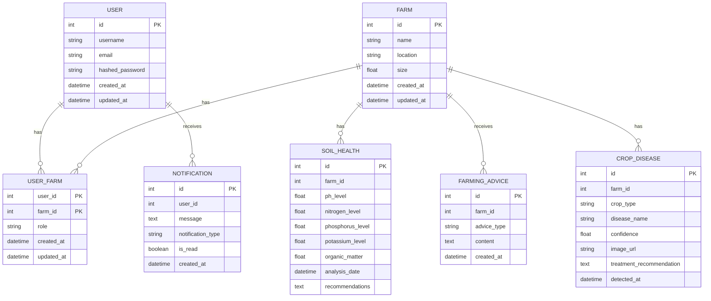

# Farmer's Guide



### Explanation
- **Entities**:
  - `USER`, `FARM`, `SOIL_HEALTH`, `NOTIFICATION`, `FARMING_ADVICE`, `CROP_DISEASE`, `USER_FARM`
  
- **Relationships**:
  - Users can have many notifications, and notifications belong to one user.
  - Farms can have many soil health records, farming advice, crop diseases, and user-farm relationships.
  - Soil health records, farming advice, and crop diseases belong to one farm.
  - The `USER_FARM` table creates a many-to-many relationship between users and farms, with additional attributes such as role, created_at, and updated_at.


## How to Contribute

Farmer guide API is a Python application, so you'll need a working Python environment to run it.

### Python Version

The API currently requires Python 3.9+.

### Create a Virtual Environment
It's recommended to create and activate a virtual environment before installing dependencies.

Python offers a built-in method for installing lightweight virtual environments, the `venv` module. To create a virtual environment with this command:

```shell
$ python3 -m <path to virtual environment>
```

After you've created your new virtual environment, you'll need to activate it in order to ensure subsequent commands use it instead of your system's default Python environment.

```shell
$ source .venv/bin/activate
```
### Install Dependencies
After you've created your virtual environment, you'll want to ensure that the correct dependencies are installed.

Run the pip command below to instead dependencies

```shell
 $  pip install -r requirements.txt
```
### Initialize Pre-Commit Hooks in the Repository

To configure git to use the API's configured pre-commit hooks (defined in [.pre-commit-config.yaml](.pre-commit-config.yaml)).

### Install the Pre-Commit Hook Package with Pip

```shell
$ python3 -m pip install pre-commit

$ pre-commit install
```
